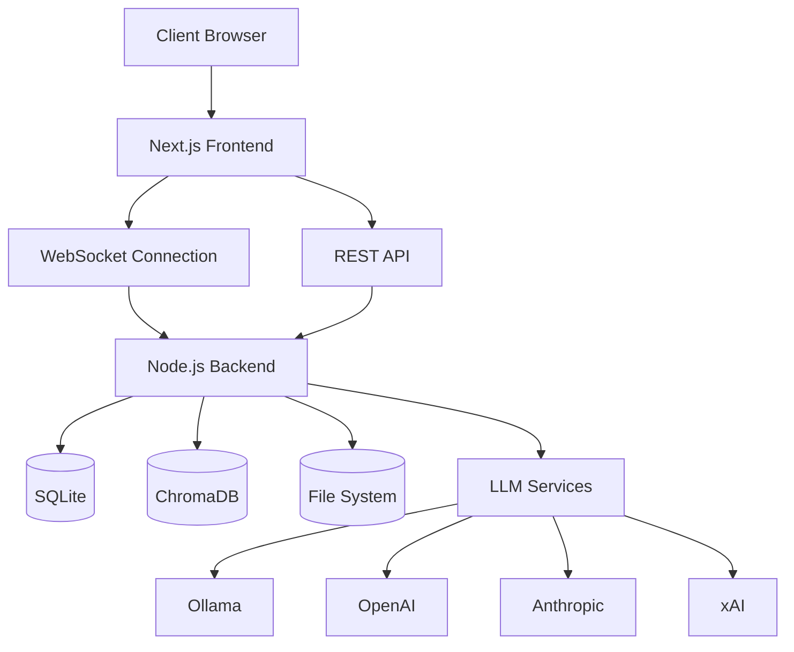

# Architecture Overview

## System Components

1. **Frontend (Next.js)**
   - React components for UI
   - Client-side state management
   - API integration
   - Real-time updates via WebSocket

2. **Backend (Node.js)**
   - Express server
   - WebSocket server
   - API endpoints
   - Service orchestration

3. **Database**
   - SQLite for metadata
   - ChromaDB for vector storage
   - File system for document storage

4. **AI Services**
   - Ollama integration
   - OpenAI integration
   - Anthropic integration
   - xAI integration

## Architecture Diagram

